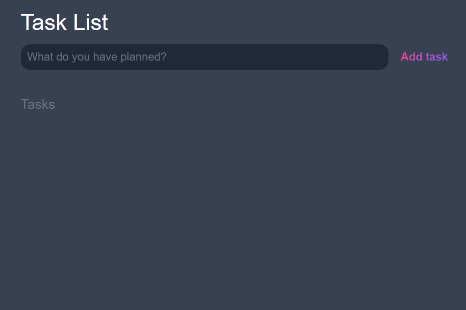
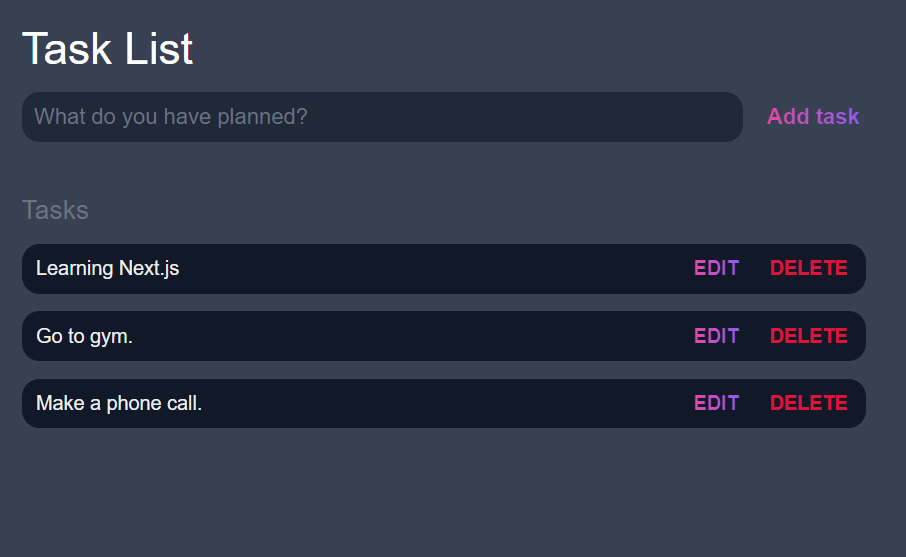
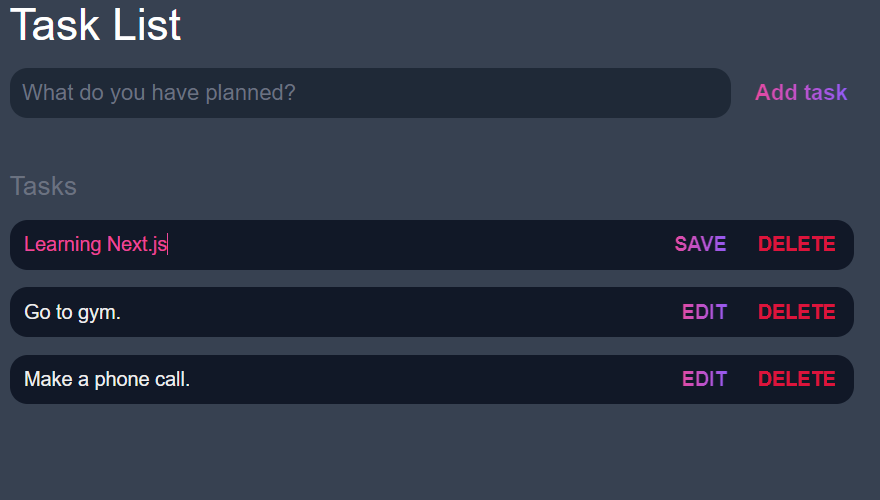

# todo app

## A todo app, written in hmtl, css and javascript.

A user may add to todo task list, view all the tasks they have to complete,, edit a task. If the task is completed then just click on that task after clicking it will show as completed and the completed task can be deleted by the "Delete Button".

### UI Of ToDo App

 
 
 

